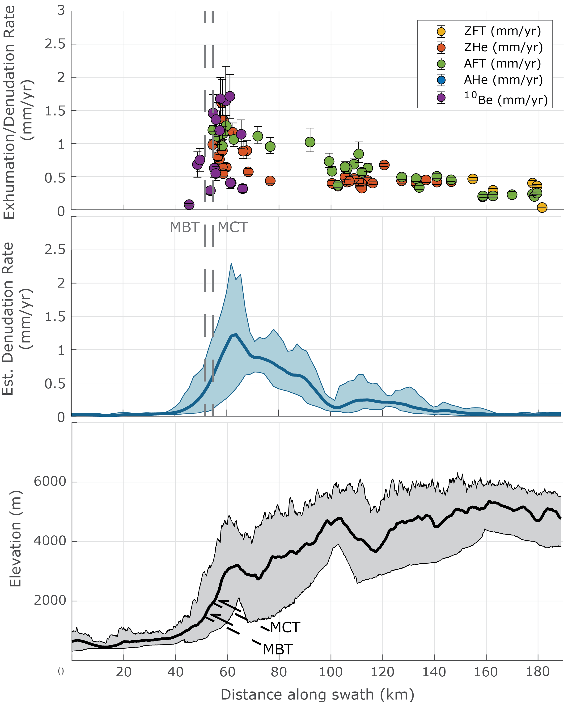

# <u>Have spatial patterns in erosion changed over time in the Northwest Himalayas?</u>

## <i> Under Construction... </i>

<i>Penserini, Brian D., Kristin D. Morell, Vincent Godard, et al. “Modern Exhumation Patterns of the Northwest Himalayas Resolved using 10Be-derived Denudation Rates and Topographic Analyses.” (in prep).</i>
