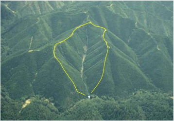

One of the most widely exploited principles in tectonic geomorphology is that the slope of fluvial channels (i.e., river channels) will adjust to reach a balance between the rates of rock uplift and channel incision. If you've ever gone hiking in the mountains, odds are that some point you saw a fast flowing river that presumably had a steep channel bed. Now think about a river like the Missouri River, which runs through the Great Plains. The bed of the Missouri is relatively flat, just like the surrounding topography. In mountains, the rates of rock uplift (i.e., the rate at which rocks undergo vertical motion, usually in response to tectonic processes) are high relative to rock uplift rates within tectonically quiescent, flat-lying regions like the Great Plains.

#<i>Under Constuction...</i>

|  | 
|:--:| 
| ** |

<i>Penserini, Brian D., Joshua J. Roering, Ashley Strieg. “A morphologic proxy for debris flow erosion with application to the earthquake deformation cycle, Cascadia Subduction Zone, USA.” Geomorphology 282, 150–161 (2017). https://doi.org/10.1016/j.geomorph.2017.01.018</i>
