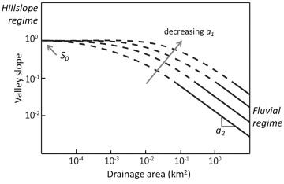
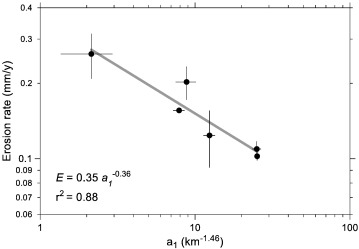
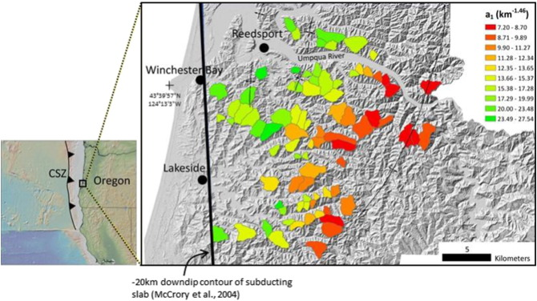
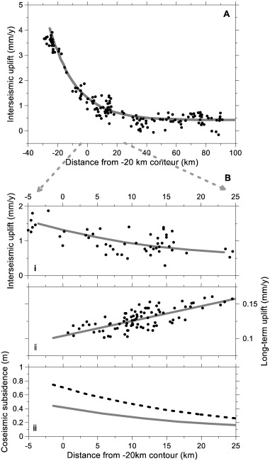

One of the most widely exploited principles in tectonic geomorphology is that the slope of fluvial channels (i.e., river channels) will adjust over time to maintain a balance between the rate of rock uplift and the channel incision rate. If you've ever gone hiking in the mountains, odds are that some point you saw a fast flowing river that presumably had a steep channel bed. Now think about a meandering river like the Missouri River, which runs through the Great Plains. The bed of the Missouri is relatively flat, just like the surrounding topography. In mountains, the rates of rock uplift (i.e., the rate at which rocks undergo vertical motion, usually in response to tectonic processes) are high relative to rock uplift rates within tectonically quiescent, flat-lying regions like the Great Plains, and this is reflected in the river geometry. Using this principle, geomorphologists often use channel slope as a proxy for erosion and rock uplift rates, assuming erosion and uplift are perfectly balanced.

This principle works well in areas where this assumption is valid, however there are many steep landscapes where rivers only represent a small proportion of that landscape. Therefore, this proxy becomes less useful as estimates of erosion/uplift rates are restricted to areas where rivers are present. This is the case for the Oregon Coast Range, where over 80% of the valley network is generated by episodic debris flows, rather than rivers, as shown in the figure below. 

|  | 
|:--:| 
| *A typical debris-flow-dominated catchment in the Oregon Coast Range. Yellow line represents the catchment boundary and thin white lines correspond to debris flow tracks that dominate large portions of the valley network.* |

One way in which geomorphologists classify portions of a landscape as being a "hillslope" or a "channel", for instance, is through the relationships between surface gradient (<i>S</i>) and contributing drainage area (<i>A</i>), typically measured using a digital elevation model (DEM) and simulating surface flow in a desktop GIS program. River channels typically display an inverse linear relationship between log(<i>S</i>) and log(<i>A</i>) for <i>A</i> > 0.1-1 km2, whereas hillslopes in steeplands typically display relatively constant slopes at <i>A</i> < 100-1000 m2 (<i>see figure below</i>). Since debris flows are the dominant erosional process in the portions of the landscape between hillslopes and rivers, the signature of debris-flow scour and incision should be reflected in the relationship between <i>S</i> and <i>A</i> for <i>A</i> between 100 m2 and 1 km2. [Stock and Dietrich (2003)](https://agupubs.onlinelibrary.wiley.com/doi/epdf/10.1029/2001WR001057) proposed a slope-area relationship that can capture the signatures of hillslopes and rivers, as well as the transition between the two regimes where debris-flow erosion dominates: <i>S</i> = <i>S0/(1 + a1Aa2</i>), where <i>S0</i> is essentially the threshold <i>S</i> along hillslopes, <i>a1</i> is an empirical constant that is inversely proportional to the curvature of the transition between the hillslope and river log(<i>S</i>)-log(<i>A</i>) relationships, and <i>a2</i> is essentially the slope of the log(<i>S</i>)-log(<i>A</i>) relationship at large <i>A</i>, in the fluvial regime. 

|  | 
|:--:| 
| *Schematic plot of drainage area vs. valley slope for forested, steepland catchments. At small areas, slope is relatively invariant and set by threshold-driven debris flow initiation processes. At large drainage areas, slope varies as an inverse power law with area, reflecting fluvial-dominated erosion (i.e., river incision). Intermediate areas in this plot represent debris flow-dominated terrain wherein a curved slope-area relationship connects the hillslope and fluvial domain. The value of a1 represents the curvature or sharpness of the transition and is proposed to correlate with erosion (or uplift) rate.* |

In this work, I wanted to see if the Stock and Dietrich relationship could be used to estimate erosion and rock uplift rates in these regions where debris-flow processes dominate, using high-resolution (1-m) Lidar DEMs to extract slope and area. Such high resolution is needed, since debris-flow initiation occurs at drainage areas much smaller than one grid cell in a typical SRTM DEM (~30-m resolution, 900 m2 cell area). What we found is that the <i>a1</i> parameter in the Stock and Dietrich relationship has a strong inverse power law relationship with erosion rates estimated using cosmogenic radionuclides (<i>see figure below</i>). 

|  | 
|:--:| 
| *Erosion rate decreases as a power law function (thick gray line) of a1. Error bars reflect two standard errors.* |

Since erosion rate and <i>a1</i> are strongly correlated (R2 = 0.88), we mapped <i>a1</i> for many debris-flow-dominated catchments within the Oregon Coast Range (<i>see figure below</i>) to get an idea of how erosion rates are varying across the range. Using our relationship between erosion rate and <i>a1</i>, we see that erosion rates are highest ~20 km inland from the coast and decrease westward, reflecting a westward decrease in uplift rate, as well. Since the landscape records erosion rates over relatively long timescales (> 10,000 years), we consider uplift rates estimated using <i>a1</i> to be <b>long-term uplift rates</b>.

|  | 
|:--:| 
| *Study catchments are represented by polygons with coloration indicative of the best fitting a1 value. Values of a1 decrease inland, which reflects a trend of increasing erosion (or uplift) rate. No major faults have been identified in this area, axes of gentle folds are shown.* |

What's most interesting about the pattern of long-term uplift rates revealed by our analysis, is that it displays the opposite trend of [interseismic uplift rates from leveling data](https://agupubs.onlinelibrary.wiley.com/doi/epdf/10.1029/2008JB005679) along the Oregon Coast (which we consider to be <b>short-term uplift rates</b> since they record uplift resulting from interseismic locking of the [Cascadia Subduction Zone](https://en.wikipedia.org/wiki/Cascadia_subduction_zone)). Large megathrust earthquakes on the Cascadia Subduction Zone are assumed to be periodic, with a recurrence interval of ~300-600 years, such that elastic strain accumulated during the interseismic period (i.e., between earthquakes) is released during each earthquake, while inelastic strain accumulates over time. By assuming that <b>short-term uplift rates</b> recorded by leveling data reflects the total interseismic strain accumulation and that <b>long-term uplift rates</b> recorded by our analysis of <i>a1</i> in debris-flow-dominated catchments reflect the inelastic strain rate, then we can approximate the amount of elastic strain released by a megathrust earthquake. Along the coast, this elastic strain release results in [coseismic subsidence](https://blogs.openquake.org/hazard/2019/11/19/coseismic-uplift-subsidence/), which can submerge portions of the coast, threatening coastal communities. Below is a figure summarizing the observations of short-term uplift rates, long-term uplift rates (<i>this study</i>), and estimates of coseismic subsidence for different earthquake recurrence intervals. <b>This work demonstrates that the signature of debris-flow scour and incision can be used to estimate erosion rates and better understand underlying tectonic processes in steep landscapes.</b>

|  | 
|:--:| 
| *Uplift and subsidence transect. (A) Interseismic uplift rates plotted with distance from the -20 km contour. Black dots represent leveling measurements, with the gray line a stiff spline fit to the central coast data from Burgette et al. (2009).(B) (i) A subset of interseismic uplift data from (A). (ii) Long-term erosion (or uplift) rate plotted with distance from the -20 km contour. Black dots represent the raw values obtained using the erosion rate - a1 function and assuming erosion balances uplift. (iii) Coseismic subsidence estimates using the trends from (A) and (B) and subduction earthquake recurrence intervals of 300 (solid) and 500 (dashed) years, respectively.* |

If you would like to learn more about this project, please check out the [full manuscript](https://drive.google.com/file/d/1SRDyyLrztreJ2XbKYnnIZn9KkRt5N350/view) published in <i>Geomorphology</i>.

<i>Penserini, Brian D., Joshua J. Roering, Ashley Strieg. “A morphologic proxy for debris flow erosion with application to the earthquake deformation cycle, Cascadia Subduction Zone, USA.” Geomorphology 282, 150–161 (2017). [https://doi.org/10.1016/j.geomorph.2017.01.018](https://www.sciencedirect.com/science/article/abs/pii/S0169555X16306821?via%3Dihub)</i>
