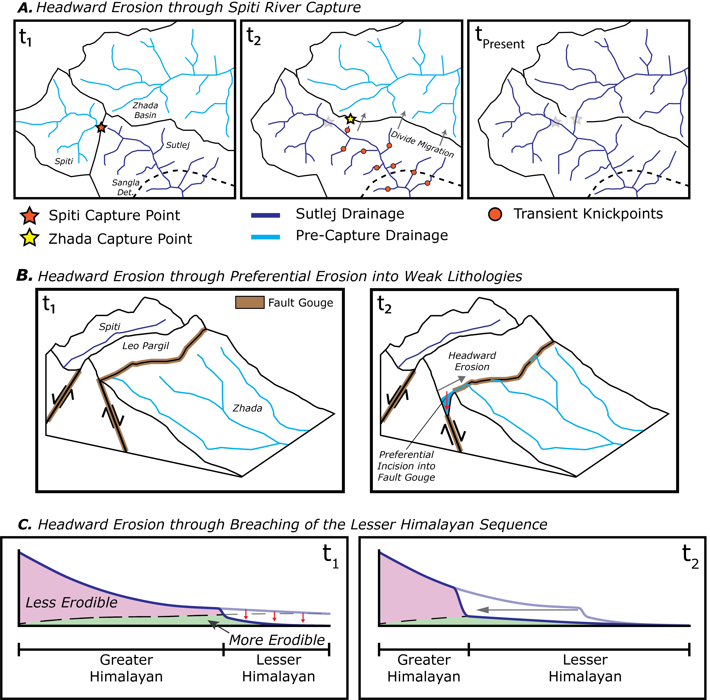
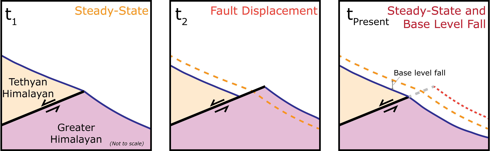
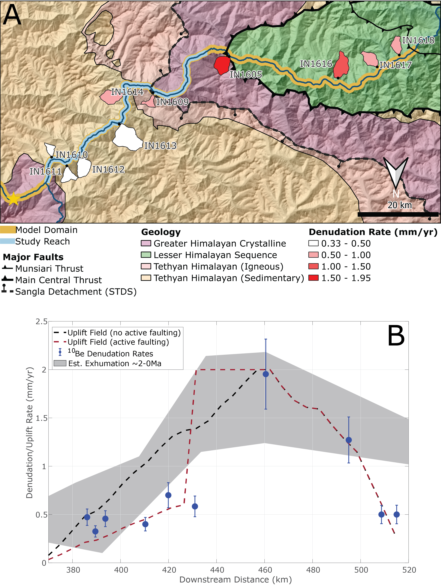

At the simplest level, drainage capture is driven by an imbalance of erosion rates across a drainage divide. In the case of the [Zhada Basin getting captured by the Sutlej River](https://BPenserini.github.io/Research/ZhadaCapture), this imbalance appears to result from headward erosion, which is the process by which stream channels elongate as channel heads migrate in the direction opposite from stream flow. However, we don't know what exact mechanism, or mechanisms, caused the headward erosion needed for this event to occur. Based on geological observations near the capture point, I proposed three possible mechanisms (<i>outlined in the figure below</i>) that could have generated the headward erosion necessary to initiate capture of the Zhada Basin.

|  | 
|:--:| 
| *Three mechanisms that may have initiated capture of the Zhada Basin. (A) <b>Headward erosion is generated by a previous capture event</b>, whereby the Sutlej captured the Spiti River, a tributary to the Sutlej. At t1, incipient capture of the Spiti occurs, integrating the river into the Sutlej. At t2, increased river discharge from Spiti capture results in increased channel incision along the Sutlej downstream from the Spiti capture point. This generates headward erosion in Sutlej tributaries, which manifests as transient knickpoints, eventually breaching the drainage divide with the Zhada Basin. At tPresent, Zhada capture results in the modern geometry of the Sutlej drainage. (B) <b>Headward erosion is generated by preferential incision into weak rocks.</b> At t1, the Zhada Basin is enclosed and brittle faulting has generated weakened rocks along the flanks of the Leo Pargil dome. These fault zones serve as preferential pathways for river incision, leading to headward erosion and entrenchment of stream channels by time t2. Focused incision along the entrenched channel leads to capture. (C) <b>Headward erosion generated by incision through resistant Greater Himalayan rocks into softer Lesser Himalayan rocks</b>, demonstrated in profile view along the Sutlej River. At t1, the downstream portion of the Sutlej has incised through Greater Himalayan rocks, generating a topographic scarp near the contact with Lesser Himalayan rocks. At t2, the scarp has propagated upstream and will eventually reach the drainage divide, assisting with drainage capture.* |

Recent studies have also suggested that the South Tibetan Detachment System (STDS), a >2,000-km long system of faults along the Himalayan rangecrest thought to have been inactive for the past >10 million years, may actually be currently active. Given that the STDS intersects the Sutlej River downstream from the Zhada capture point, it remains possible that if the fault is active, that it may have also played a role in initiating capture (<i>as outlined in the figure below</i>).

|  | 
|:--:| 
| *Mechanism for headward erosion generated by fault slip along the South Tibetan Detachment System. At t1, the Sutlej river profile (solid blue curve, orange dashed curve in subsequent frames) is equilibrated, with the footwall experiencing greater rock uplift. At t2, fault slip offsets the river (solid blue curve, red dashed curve in subsequent frame). At tPresent, incision has kept pace with footwall uplift and incises to retain equilibrium. The net effect of fault slip is base level fall relative to the initial profile, which generates headward erosion.* |

Each of these four mechanisms predicts a different history of incision along the Sutlej. To better understand which of these mechanisms could have been responsible for driving drainage capture, we use geochronological tools to resolve the spatiotemporal pattern of incision along the river. By comparing the pattern of incision revealed using geochronology to expected patterns of incision corresponding to the different potential mechanisms for capture, we can identify which mechanisms reasonably replicate observed incision patterns. The geochronological technique I used is called [(U-Th)/He thermochronometry](https://agupubs.onlinelibrary.wiley.com/doi/10.1029/2018TC005312), or more simply, "helium dating." Helium (He) dating determines the amount of time since a rock last cooled below a certain temperature, called the closure temperature. If we know how temperature varies with depth below the surface, then we can use the He date of a certain mineral grain within that rock (<i>like the apatite shown below</i>) to estimate how fast it was eroded, or exhumed, to the surface.

|  | 
|:--:| 
| *Microscope image of an apatite grain used for (U-Th)/He analysis. This grain was extracted from a granodiorite sample collected along the Sutlej River in Himachal Pradesh. The apatite shown here is ~110 microns long, which is about the size of a grain of table salt.* |

Using <i>QTQt</i>, a program that uses Bayesian trans-dimensional Markov chain Monte Carlo analyses to generate possible thermal histories from  dates, and <i>age2edot</i>, a program that estimates exhumation rates from He dates, we inferred the history of erosion along the Sutlej River over the past several million years. Next, I compared the history of erosion inferred from He dates to results from river incision models, where we simulated the incision in response to drainage capture for several different scenarios corresponding to different potential capture mechanisms, as shown in the first figure on this page. I found that only model scenarios that included active fault slip along the STDS replicated the pattern of incision recorded by He dates along the Sutlej. While these results do not definitively indicate that fault slip along the STDS directly initiated capture of the Zhada Basin, they imply that there is a potential kinematic relationship, and that the fault appears to be active in the Sutlej region, which is a novel discovery.

|  | 
|:--:| 
| *(A) <b>Incision model domain along the Sutlej River</b>. Tributary catchments that were sampled for cosmogenic radionuclide-derived denudation (i.e., erosion) rates are shown and were used to approximate the rock uplift field in incision models. Note that the orientation of this map is inverted. (B) <b>Plot of different uplift fields used in model scenarios</b>. We applied two different uplift fields to model simulations to account for uncertainty in modern uplift rates revealed by previous thermochronometric dates and our denudation rates.* |

<i>A manuscript with additional project details is currently in the final stages of preparation. A link to the manuscript will be added to this page once it has been peer-reviewed and accepted for publication.</i>

<i>Penserini, Brian D., Kristin D. Morell, Brian J. Yanites, et al. “Quaternary Slip along the Himalayan Crest as a Novel Driver of Drainage Capture.” (in prep).</i>


